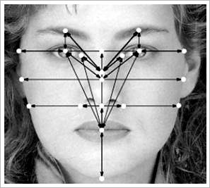
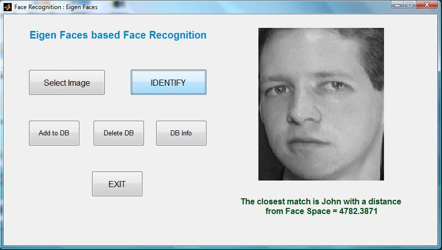
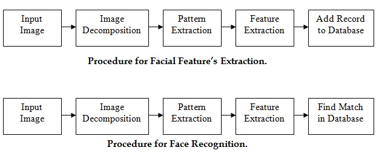

# FaceDetect
Face recognition system implemented using the Viola-Jones algorithm, which is a fast and efficient algorithm that can be used to identify faces in real-time. The implementation is done in MATLAB

Its using blind spatial clustering of nearby detection responses, which is known as a major factor of localization inaccuracy.

# Sample Result:

# WorkFlow:

